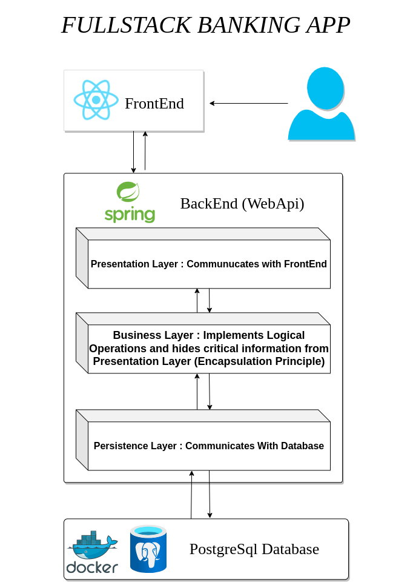
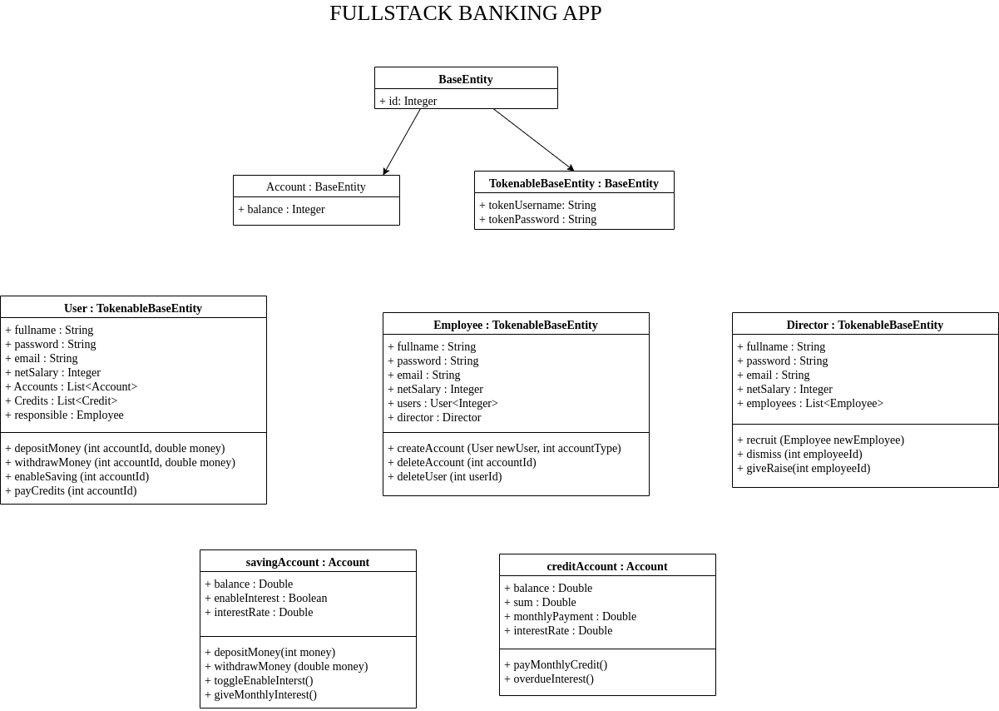

# Section 1 : Constructing Project Skeleton

## General Project Structure

Our project will be divided into two main parts: the frontend and the backend. The frontend will be responsible for the user interface and the backend will be responsible for the business logic and data storage. The frontend and backend will communicate with each other through a REST API.

In backend we used Java Spring Boot framework. Spring Boot is a framework that allows us to build stand-alone, production-grade Spring based Applications easily. It is preconfigured with the Spring’s project, so our project will be up and run quickly. It also provides a range of additional features that are common to large projects, such as embedded servers, security, metrics, health checks, and externalized configuration.

In database we will use PostgreSQL. I will running PostgreSQL in a Docker container but you can also install it locally on your machine. 

## UML Diagram

We have a base entity class called `BaseEntity` which will be extended by all other entities. It contains the `id` field which will be used to uniquely identify each entity. We have `TokenableBaseEntity` class which extends `BaseEntity` and contains the `token` field. This class will be extended by all entities that need to be tokenable.

We have `User`, `Employee`, `Director` classes which extend `TokenableBaseEntity` class. `Director` class responsible for recruiting and dismissing employees. `Employee` class responsible for creating and deleting account for users. `User` class is customer for bank. It can deposit and withdraw money from bank account. It can request for loan and credit card. It can also transfer money to other users.

Users can have N number of accounts. Employee can have N number of users and Director can have N number of employees. Director doesn't have direct relation with users. 