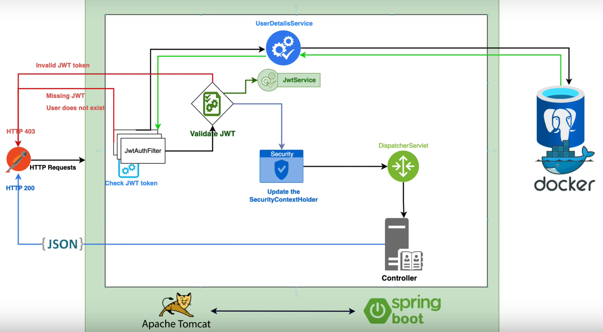
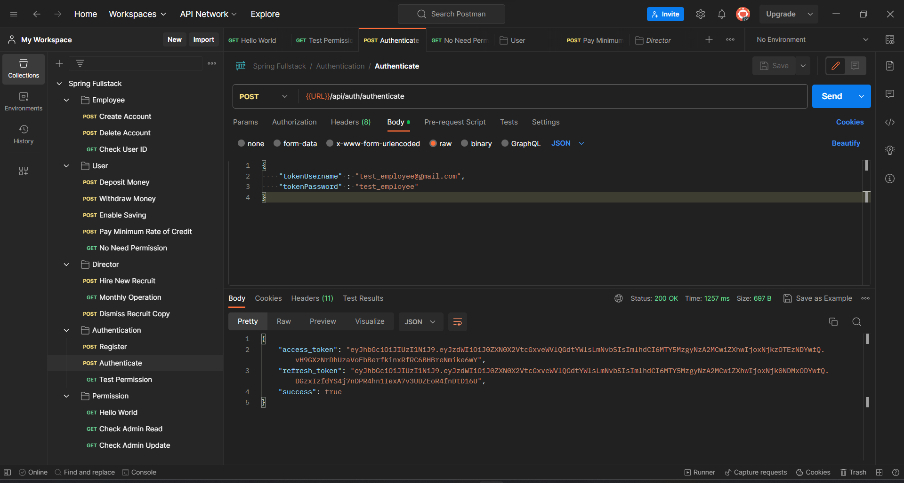
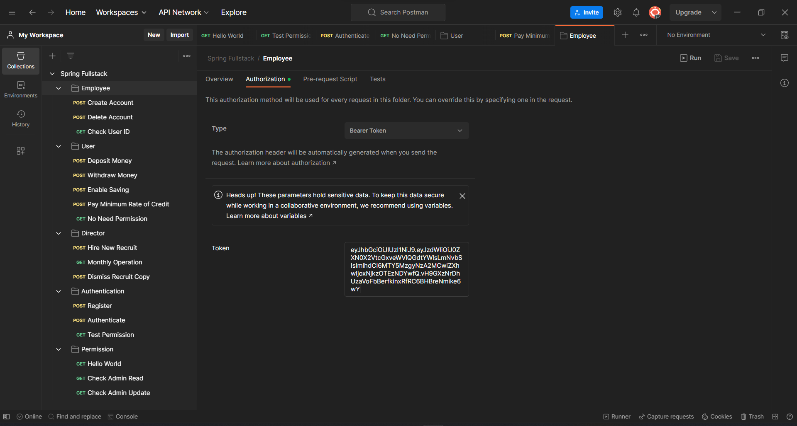
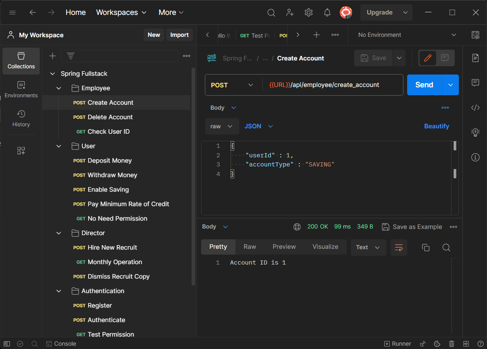
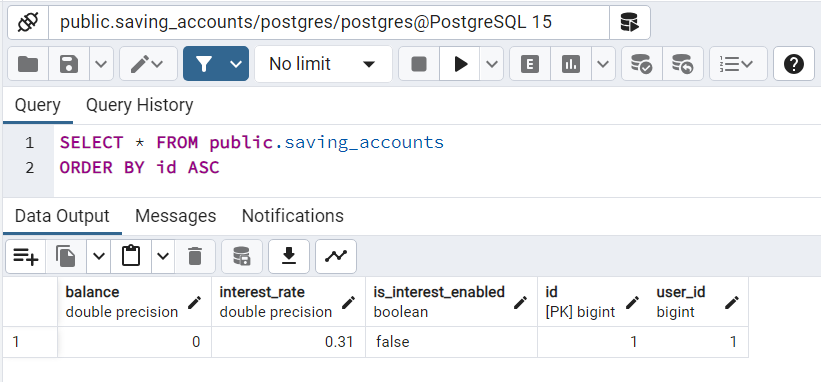
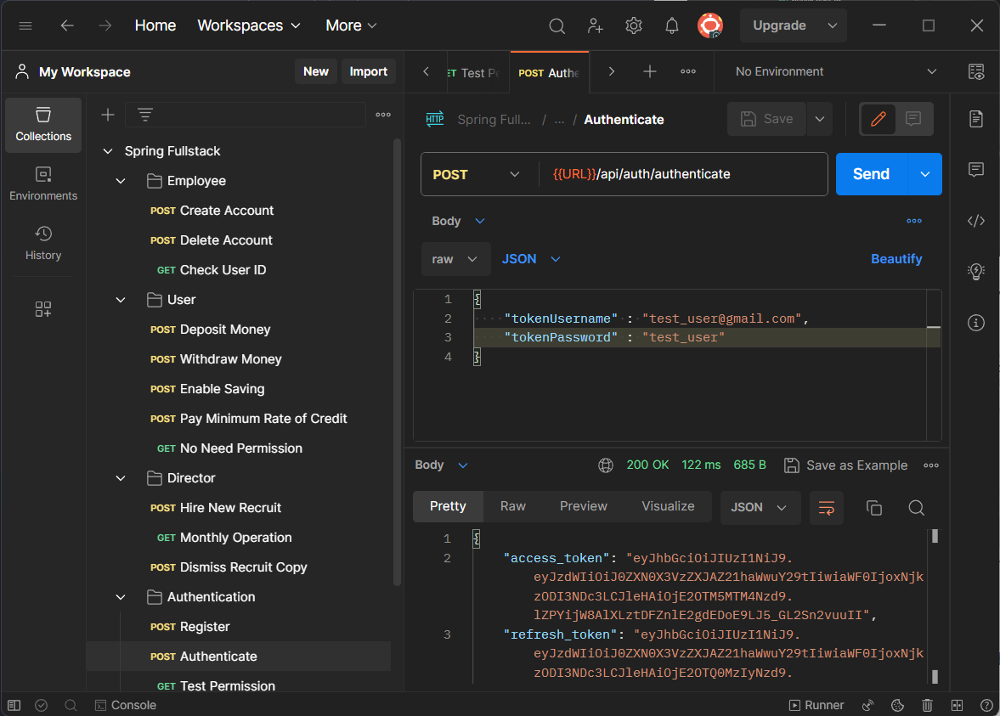
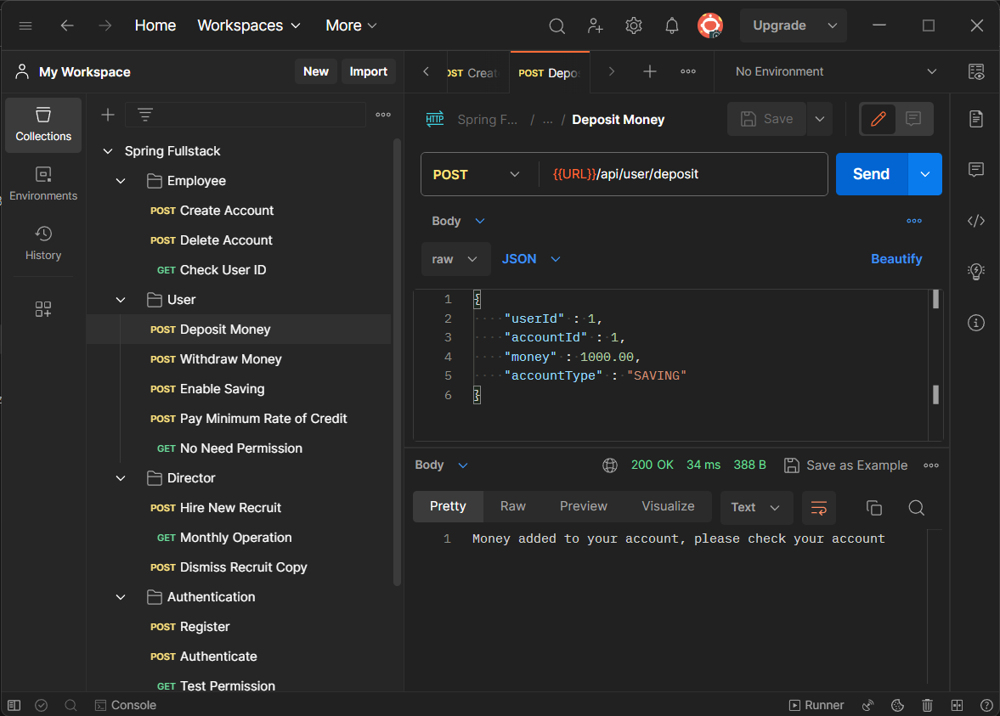
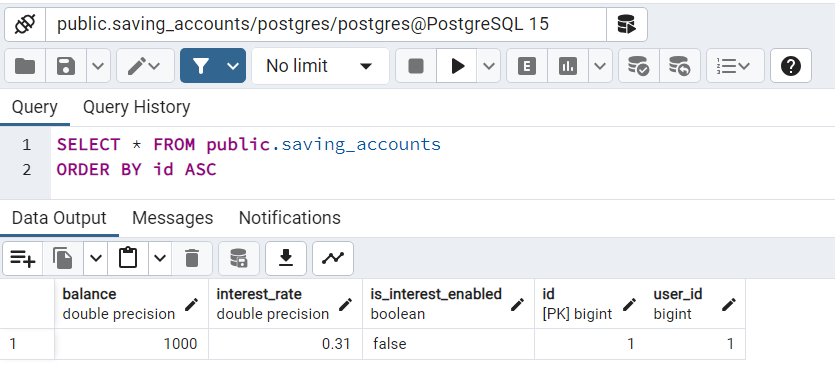

# Section 5 : Implementing Spring Security 6



In this section we will implement JWT authentication and authorization in our application. JWT(Json Web Token) is a token based authentication mechanism. It is a compact and self-contained way for securely transmitting information between parties as a JSON object. This information can be verified and trusted because it is digitally signed. JWTs can be signed using a secret (with the HMAC algorithm) or a public/private key pair using RSA or ECDSA.

I must admit that this section is a bit tricky and I had to do a lot of research to get it working. I will try to explain the concepts as much as I can. 

First we will add Spring Security dependency to our project.

```xml
<dependency>
    <groupId>org.springframework.boot</groupId>
    <artifactId>spring-boot-starter-security</artifactId>
    <version>3.0.10</version>
</dependency>
```

This dependincies are required for JWT implementation but i noticed that we already added this dependencies previous sections. So we don't need to add them again.

```xml
<dependency>
    <groupId>io.jsonwebtoken</groupId>
    <artifactId>jjwt-api</artifactId>
    <version>0.11.5</version>
</dependency>
<dependency>
    <groupId>io.jsonwebtoken</groupId>
    <artifactId>jjwt-impl</artifactId>
    <version>0.11.5</version>
</dependency>
<dependency>
    <groupId>io.jsonwebtoken</groupId>
    <artifactId>jjwt-jackson</artifactId>
    <version>0.11.5</version>
</dependency>
```

Firstly we need to create a entity that implements `org.springframework.security.core.userdetails.UserDetails` interface. This interface is used by Spring Security to perform authentication and authorization. I added a new entity named "TokenUser" for this purpose. 

```java
// imports

@Data
@Builder
@NoArgsConstructor
@AllArgsConstructor
@Entity
@Table(name = "token_users")
public class TokenUser implements UserDetails {
    @Id
    @GeneratedValue(strategy = GenerationType.IDENTITY)
    private Long id;
    private String username;
    private String password;

    @Enumerated(EnumType.STRING)
    private Role role;

    @OneToMany(mappedBy = "user")
    private List<Token> tokens;

    @Override
    public Collection<? extends GrantedAuthority> getAuthorities() {
        return role.getAuthorities();
    }

    @Override
    public boolean isAccountNonExpired() {
        return true;
    }

    @Override
    public boolean isAccountNonLocked() {
        return true;
    }

    @Override
    public boolean isCredentialsNonExpired() {
        return true;
    }

    @Override
    public boolean isEnabled() {
        return true;
    }
}
```

As you can see, this entity has a `role` field. This field is used for authorization. We will use this field to determine which user can access which endpoint. 

```java
// imports

@RequiredArgsConstructor
public enum Role {
    USER(Set.of(
            READ_MY_ACCOUNT,
            UPDATE_MY_ACCOUNT,
            DELETE_MY_ACCOUNT,
            CREATE_NEW_ACCOUNT
    )),
    EMPLOYEE(
            Set.of(
                    READ_ALL_ACCOUNTS,
                    DELETE_ALL_COUNTS,
                    CREATE_NEW_ACCOUNT_FOR_ALL
            )
    ),
    DIRECTOR(
            Set.of(
                    HIRE_NEW_RECRUIT,
                    DISMISS_RECRUIT,
                    FULLFILL_MONTHLY_OPERATION
            )
    ),
    ADMIN(
            Set.of(
                    FULL_ACCESS
            )
    )
    ;

    @Getter
    private final Set<Permission> permissions;

    public List<SimpleGrantedAuthority> getAuthorities() {
        var authorities = getPermissions()
                .stream()
                .map(permission -> new SimpleGrantedAuthority(permission.getPermission()))
                .collect(Collectors.toList());
        authorities.add(new SimpleGrantedAuthority("ROLE_" + this.name()));
        return authorities;
    }
}
```

And if you look at the `Role` enum, you can see that each role has a set of permissions. We can also use this permissions to determine which user can access which endpoint. 

```java
// imports

@RequiredArgsConstructor
public enum Permission {
    FULL_ACCESS("full_access"),
    READ_MY_ACCOUNT("read_my_account"),
    UPDATE_MY_ACCOUNT("update_my_account"),
    CREATE_NEW_ACCOUNT("create_new_account"),
    DELETE_MY_ACCOUNT("delete_my_account"),
    READ_ALL_ACCOUNTS("read_all_accounts"),
    DELETE_ALL_COUNTS("delete_all_accounts"),
    CREATE_NEW_ACCOUNT_FOR_ALL("create_new_account_for_all"),
    HIRE_NEW_RECRUIT("hire_new_recruit"),
    DISMISS_RECRUIT("dismiss_recruit"),
    FULLFILL_MONTHLY_OPERATION("fulfill_monthly_operation"),
    ;

    @Getter
    private final String permission;
}
```

With Permissions we can create different Roles and this gives us Flexibility. For example, we can create a new role named "ADMIN" and give it all permissions. Or we can create a new role named "EMPLOYEE" and give it only "READ_ALL_ACCOUNTS" and "DELETE_ALL_COUNTS" permissions.

And since we created a entity for authentication operations we will remove sensitive information from `User`, `Employee`, `Director` entities. We will use `TokenUser` entity for authentication operations.

```java
// imports
public class User{
    // BEFORE
    /*
    private String username;
    private String password;
    */

    // AFTER
    @OneToOne
    @JoinColumn(name = "token_user_id")
    private TokenUser tokenUser;

    // .....
}
```

We need inform Spring Security about our `TokenUser` entity. For this purpose we will add a few method to main (`FullstackSpringReactBankingappApplication`) class.

```java
// imports

@SpringBootApplication
@RequiredArgsConstructor
public class FullstackSpringReactBankingappApplication {

	// ....

	@Bean
	public PasswordEncoder passwordEncoder() {
		return new BCryptPasswordEncoder();
	}

	@Bean
	public AuthenticationProvider authenticationProvider() {
		DaoAuthenticationProvider authProvider = new DaoAuthenticationProvider();
		authProvider.setUserDetailsService(userDetailsService());
		authProvider.setPasswordEncoder(passwordEncoder());
		return authProvider;
	}

	private final TokenUserRepository tokenUserRepository;
	@Bean
	public UserDetailsService userDetailsService() {
		return username -> tokenUserRepository.findByUsername(username)
				.orElseThrow(() -> new UsernameNotFoundException("User not found"));
	}

	@Bean
	public AuthenticationManager authenticationManager(AuthenticationConfiguration config) throws Exception {
		return config.getAuthenticationManager();
	}
}
```

In this code snippet we created a `PasswordEncoder` bean. This bean is used for encoding passwords. We also created a `AuthenticationProvider` bean. This bean is manage all settings for authentication. We also created a `UserDetailsService` bean. This bean is used for fetching user information from database. 

For the purpose of managing HTTP requests we will create a new class named `SecurityConfig`. For example if request `api/auth` we need to allow it. Because we need to authenticate user. But if request `api/user` we need to check if user has permission to access this endpoint. 

```java
// imports
@Configuration
@EnableWebSecurity
@RequiredArgsConstructor
@EnableMethodSecurity
public class SecurityConfiguration {

    private final JwtAuthenticationFilter jwtAuthFilter;
    private final AuthenticationProvider authenticationProvider;
    private final LogoutHandler logoutHandler;

    @Bean
    public SecurityFilterChain securityFilterChain(HttpSecurity http) throws Exception {
        http
                .csrf()
                .disable()
                .authorizeHttpRequests()
                .requestMatchers(
                        "/api/auth/**",
                        "/api/user/no_need_permission"
                )
                .permitAll()
                .anyRequest()
                .authenticated()
                .and()
                .sessionManagement()
                .sessionCreationPolicy(SessionCreationPolicy.STATELESS)
                .and()
                .authenticationProvider(authenticationProvider)
                .addFilterBefore(jwtAuthFilter, UsernamePasswordAuthenticationFilter.class)
                .logout()
                .logoutUrl("/api/auth/logout")
                .addLogoutHandler(logoutHandler)
                .logoutSuccessHandler((request, response, authentication) -> SecurityContextHolder.clearContext())
        ;

        return http.build();
    }
}
```

Lastly we need to add JwtAuthFilter class to check given Bearer token is valid and if it is valid we need to authenticate user according to their role and permissions.

```java
// imports

@Component
@RequiredArgsConstructor
public class JwtAuthenticationFilter extends OncePerRequestFilter {

    private final JwtService jwtService;
    private final UserDetailsService userDetailsService;
    private final TokenRepository tokenRepository;

    @Override
    protected void doFilterInternal(
            @NonNull HttpServletRequest request,
            @NonNull HttpServletResponse response,
            @NonNull FilterChain filterChain
    ) throws ServletException, IOException {

        if (request.getServletPath().contains("/api/auth")) {
            filterChain.doFilter(request, response);
            return;
        }
        final String authHeader = request.getHeader("Authorization");
        final String jwt;
        final String userEmail;
        if (authHeader == null ||!authHeader.startsWith("Bearer ")) {
            filterChain.doFilter(request, response);
            return;
        }
        jwt = authHeader.substring(7);
        userEmail = jwtService.extractUsername(jwt);
        if (userEmail != null && SecurityContextHolder.getContext().getAuthentication() == null) {
            UserDetails userDetails = this.userDetailsService.loadUserByUsername(userEmail);
            var isTokenValid = tokenRepository.findByToken(jwt)
                    .map(t -> !t.isExpired() && !t.isRevoked())
                    .orElse(false);
            if (jwtService.isTokenValid(jwt, userDetails) && isTokenValid) {
                UsernamePasswordAuthenticationToken authToken = new UsernamePasswordAuthenticationToken(
                        userDetails,
                        null,
                        userDetails.getAuthorities()
                );
                authToken.setDetails(
                        new WebAuthenticationDetailsSource().buildDetails(request)
                );
                SecurityContextHolder.getContext().setAuthentication(authToken);
            }
            else{
                response.setStatus(HttpServletResponse.SC_UNAUTHORIZED);
                response.setContentType(MediaType.APPLICATION_JSON_VALUE);
                response.getWriter().write("Bearer Token is Not Valid !!!");
                return;
            }
        }
        filterChain.doFilter(request, response);
    }
}
```

In this class we firstly check if request path contains `/api/auth`. If it contains we will allow it. Because we need to authenticate user. But if request path doesn't contains `/api/auth` we will check if request has a valid Bearer token. If it has a valid Bearer token we will authenticate user according to their role and permissions. If it doesn't have a valid Bearer token we will return `HttpServletResponse.SC_UNAUTHORIZED` status code.

If we want to apply restrictions to endpoints we need to add `@PreAuthorize` annotation to endpoint. For example if we want to allow only "ADMIN" role to access `api/user` endpoint we need to add `@PreAuthorize("hasRole('ADMIN')")` annotation to endpoint.

```java
// imports

@RestController
@RequestMapping("/api/director")
@RequiredArgsConstructor
@PreAuthorize("hasAnyRole('DIRECTOR', 'ADMIN')")
public class DirectorController {
    // ....     
}
```

For example DirectorController Requests can only be made by users with the "DIRECTOR" or "ADMIN" role. If a user with the "USER" role tries to access this endpoint, they will get a 403 Forbidden error.

We also can use `@PreAuthorize` annotation to restrict endpoints according to permissions. For example if we want to allow only "READ_ALL_ACCOUNTS" permission to access `api/user` endpoint we need to add `@PreAuthorize("hasPermission('READ_ALL_ACCOUNTS')")` annotation to endpoint.

```java
// imports
@RestController
@RequestMapping("/api/user")
@RequiredArgsConstructor
public class UserController {

    private final UserService userService;

    @PostMapping("/deposit")
    @PreAuthorize("hasAnyAuthority('update_my_account', 'full_access')")
    public ResponseEntity<String> depositMoney(@RequestBody DepositMoneyDto depositMoneyDto){
        try{
            userService.depositMoneyToAccount(depositMoneyDto.getMoney(), depositMoneyDto.getUserId(),
                    depositMoneyDto.getAccountId(), depositMoneyDto.getAccountType());
        }
        catch (Exception ex){
            return ResponseEntity.status(HttpStatus.BAD_REQUEST).body(ex.getMessage());
        }
        return ResponseEntity.ok("Money added to your account, please check your account");
    }

    @PostMapping("/withdraw")
    @PreAuthorize("hasAnyAuthority('update_my_account', 'full_access')")
    public ResponseEntity<String> withdrawMoney(@RequestBody WithdrawMoneyDto withdrawMoneyDto){
        try{
            userService.withdrawMoneyFromAccount(withdrawMoneyDto.getMoney(), withdrawMoneyDto.getUserId(),
                    withdrawMoneyDto.getAccountId(), withdrawMoneyDto.getAccountType());
        }
        catch (Exception ex){
            return ResponseEntity.status(HttpStatus.BAD_REQUEST).body(ex.getMessage());
        }
        return ResponseEntity.ok("Funds have been debited from your account, please check your account");
    }

    @PostMapping("/enable_saving")
    @PreAuthorize("hasAnyAuthority('update_my_account', 'full_access')")
    public ResponseEntity<String> enableSaving(@RequestBody EnableSavingDto enableSavingDto){
        try{
            userService.enableSaving(enableSavingDto.getUserId(), enableSavingDto.getAccountId());
        }
        catch (Exception ex){
            return ResponseEntity.status(HttpStatus.BAD_REQUEST).body(ex.getMessage());
        }
        return ResponseEntity.ok("Saving Enabled for Given Account ID");
    }

    @PostMapping("/pay_minimum_rate")
    @PreAuthorize("hasAnyAuthority('update_my_account', 'full_access')")
    public ResponseEntity<String> payMinimumRate(@RequestBody PayMinimumRateDto payMinimumRateDto){
        try{
            userService.payMinimumRateOfCredit(payMinimumRateDto.getMoney(), payMinimumRateDto.getUserId(), payMinimumRateDto.getAccountId());
        }catch (Exception ex){
            return ResponseEntity.status(HttpStatus.BAD_REQUEST).body(ex.getMessage());
        }
        return ResponseEntity.ok("You paid minimum rate of credit successfully. If you deposit money more than your minimum rate it will be added into your balance");
    }

    @GetMapping("/no_need_permission")
    public String hello(){
        return "Hello world";
    }
}
```

In UserController class we applied restrictions to endpoints according to permissions. For example if we want to access `api/user/deposit` endpoint we need to have "update_my_account" or "full_access" permission. If we want to access `api/user/no_need_permission` endpoint we don't need any permission.

Let's test our new authentication system with Postman.

I created test accounts and added them to database in Runner.java

```java
// imports
@Component
@RequiredArgsConstructor
public class Runner implements CommandLineRunner {
    private final AuthenticationService authenticationService;

    @Override
    public void run(String... args) throws Exception {

        authenticationService.registerAccount(
                AccountRegisterDto.builder().email("test_director@gmail.com").netSalary(1000000.0).password("test_director").role(Role.DIRECTOR)
                        .fullName("Test Director").build()
        );

        authenticationService.registerAccount(
                AccountRegisterDto.builder().email("test_employee@gmail.com").netSalary(32500.0).password("test_employee").role(Role.EMPLOYEE)
                        .fullName("Test Employee").build()
        );

        authenticationService.registerAccount(
                AccountRegisterDto.builder().email("test_user@gmail.com").netSalary(17500.0).password("test_user").role(Role.USER)
                        .fullName("Test USER").build()
        );
    }
}
```

First We will try to create a new Saving Account for `test_user@gmail.com` user. According to our restrictions we need to have Employee or Admin role to access this endpoint. 



As you can see we got our access token for `test_employee@gmail.com`. To use this token in all Employee functions we need to add this token to Employee folder in Postman.



Now we can create a new `Create Account` request.



We can check database at this point. As you can see account created successfully in `saving_accounts` table.



Now we will try to authenticate with user that owns this account by the means of `test_user@gmail.com`.



And copy token to User folder in Postman. Try to deposit some money to account.





I will not explain all files we added for authentication and authorization. You can check them in repository. I have admit i cant understand fully how this system works. But i explained all needed parts. I hope you can understand this system better than me. For more information you can check [this](https://www.youtube.com/watch?v=KxqlJblhzfI&t=112s) video.